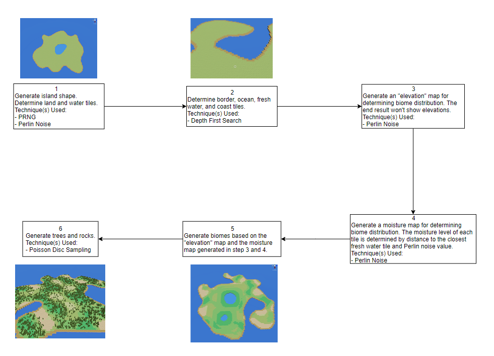
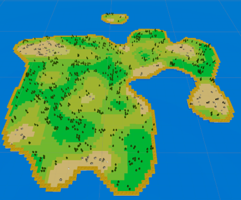

# My Procedural Island Generation
I used Unity Engine to develop a 3D tile-based island generation tool. There are a variety of parameters that can be modified in order to generate a desired island terrain, including map seed, moisture level, and etc. In this project, each procedural generated island is a tile-based terrain with land, ocean, biomes, resources (trees/rocks). The Explanation section briefly describes each step during the process of procedural island generation.

## Explanation

By following the procedure above, a tile-based island can be generated in the scene. The screenshot below illustrates a top-down view of a procedural generated island created by the tool.

Although the generator is able to create a fine island with limited type of resources, it is still far from realism. There are definitely more potential features that could be further added to the tool.

## Potential Features
- Voronoi polygons: Instead of making a tile-based terrain, an island generated with voronoi polygons would certainly look more natural and irregular in shape.
- Elevations: Having actual elevations on the terrain instead of a flat terrain.
- Rivers
- More foliages and plants
- Animal flocks
- Weather system
