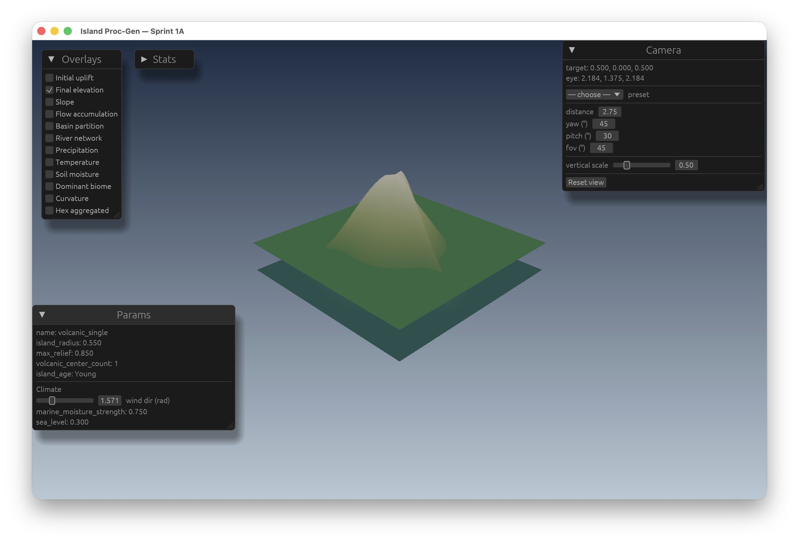

# Island-Proc-Gen

Procedural volcanic-island generator in Rust. A deterministic simulation pipeline
stitches together geomorphology (stream-power uplift + erosion), hydrology (flow
routing, river extraction), climate (orographic precipitation, water balance,
fog), and ecology (biome assignment) on a shared 2D field layer, rendered live
with `wgpu` + `egui` and exportable as CPU-side PNG galleries for headless batch
runs.

This is a single-developer research project. It is **pre-alpha** — APIs, data
formats, and visual output will change without notice. Read
[`PROGRESS.md`](PROGRESS.md) for the current state before assuming any feature
is stable.



## Status

A 17-stage canonical simulation pipeline (16 `StageId` variants + terminal
`ValidationStage`) runs at app startup, populating continuous 2D fields for
terrain height, slope, flow routing, drainage basins, rivers, temperature,
precipitation, fog, potential evapotranspiration, soil moisture, biome weights,
and hex aggregation on a 256×256 grid. Twelve live
overlays toggle in the egui panel; a wind-direction slider re-runs the
climate-ecology chain end-to-end and refreshes overlay textures on the same
frame. `cargo run -p app` opens a working window on macOS / Metal.

A windowless `--headless` harness drives the same pipeline for batch capture
and deterministic regression: `cargo run -p app -- --headless <request.ron>`
writes an artifact tree of overlay PNGs + `SummaryMetrics` + a top-level
`summary.ron`; `--headless-validate <run> --against <expected>` diffs two
summaries by blake3 hash and exits with `0` / `2` / `3` for pass / pipeline-
regression / tool-error. Two checked-in baselines live at
`crates/data/golden/headless/{sprint_1a_baseline,sprint_1b_acceptance}/`.

Nothing is stabilised yet: preset parameters, field semantics, save-file
format, and the visual package all remain fluid. The project has no binary
releases, no wasm build, and no web viewer. The end-goal shape is a deterministic
batch generator (seed + preset → PNG gallery + hex-aggregated JSON) plus a live
viewer for research exploration.

## Quick start

```bash
# Prerequisite: Rust stable, edition 2024 (rustc >= 1.85)
cargo build --workspace
cargo test  --workspace
cargo run   -p app       # opens a local winit window

# Headless batch capture (no window):
cargo run -p app --release -- \
    --headless crates/data/golden/headless/sprint_1a_baseline/request.ron

# Regression diff of a run against a checked-in baseline:
cargo run -p app --release -- \
    --headless-validate /captures/headless/<run_id>/ \
    --against crates/data/golden/headless/sprint_1a_baseline/
```

Controls in the app window:
- Left-drag — orbit
- Right-drag — pan
- Scroll — zoom
- Wind-dir slider in the Params panel — re-runs climate & ecology
- Close window — clean exit

## Layout

| Crate | Role |
|---|---|
| `crates/core` | Pure-CPU state: `WorldState`, `ScalarField2D<T>`, `Seed`, `SimulationPipeline`, `validation` (8 invariants), `FLOW_DIR_SINK` / `D8_OFFSETS` / neighborhood constants, `BiomeType` / `BiomeWeights`. Must compile without any graphics crate. |
| `crates/sim` | 17-stage canonical pipeline (16 `StageId` variants: geomorph + hydro + climate + ecology + hex projection; + terminal `ValidationStage`). `StageId` enum locks pipeline indices for `SimulationPipeline::run_from`. |
| `crates/hex` | `HexGrid` + axis-aligned box tessellation (v1 simplification; a future pass can refit to true hexagonal Voronoi). |
| `crates/data` | Built-in presets (`volcanic_single`, `volcanic_twin`, `caldera`), golden-seed snapshots, `SummaryMetrics` regression tiers. |
| `crates/gpu` | `wgpu` device/surface management, depth attachment. |
| `crates/render` | Descriptor-based `OverlayRegistry` (12 overlays), `TerrainRenderer`, `OverlayRenderer`, `SkyRenderer`, canonical palette, camera-preset LUT math. All `&'static str` field-key dispatch confined to `overlay.rs`. |
| `crates/ui` | `egui` panels — overlay toggles, camera controls, preset params (with wind-direction slider), stats. |
| `crates/app` | `winit` event loop, orbit camera, preset loading, save/load Path wrapper, slider → `run_from` wiring, and the `--headless` / `--headless-validate` harness (capture request parsing, CPU truth bake, GPU offscreen beauty, summary diff). |

Crate deps flow strictly one way: `app → render → gpu → core` and
`app → ui/sim/data → core`. `core` is a sink; nothing below it in the graph.

## Documentation

- [`docs/architecture/ARCHITECTURE.md`](docs/architecture/ARCHITECTURE.md)
  — system architecture, data model, pipeline walkthrough, the eight
  hard invariants, and the headless harness.
- [`PROGRESS.md`](PROGRESS.md) — milestone dashboard and development history.
- [`CLAUDE.md`](CLAUDE.md) — operating notes for AI coding agents working
  in this repo.
- [`crates/data/golden/headless/README.md`](crates/data/golden/headless/README.md)
  — layout of the `--headless-validate` baselines + author workflow for
  regenerating them.
- [`docs/papers/README.md`](docs/papers/README.md) — indexed paper
  knowledge base (Core Pack + per-topic add-ons).

## License

Dual-licensed under either of

- MIT License ([LICENSE-MIT](LICENSE-MIT))
- Apache License, Version 2.0 ([LICENSE-APACHE](LICENSE-APACHE))

at your option.

### Contribution

Unless you explicitly state otherwise, any contribution intentionally
submitted for inclusion in the work by you, as defined in the Apache-2.0
license, shall be dual-licensed as above, without any additional terms
or conditions.
