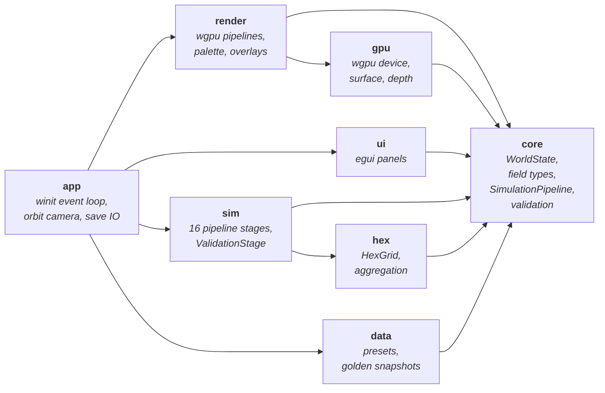
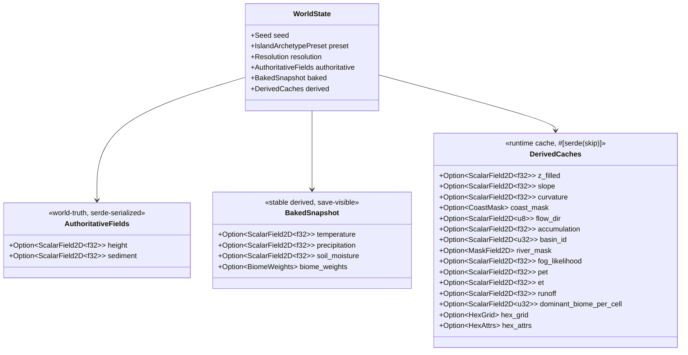
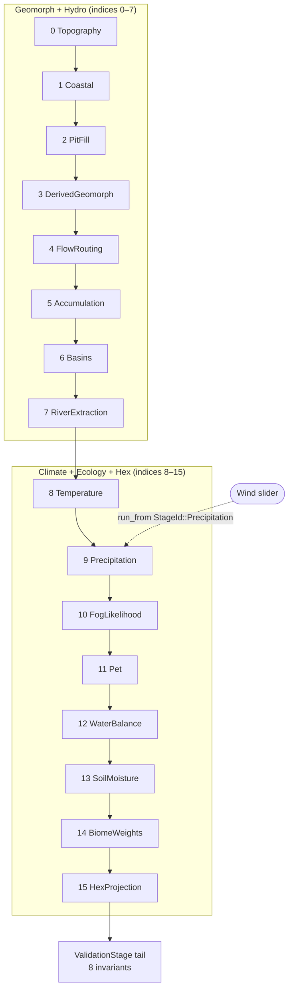
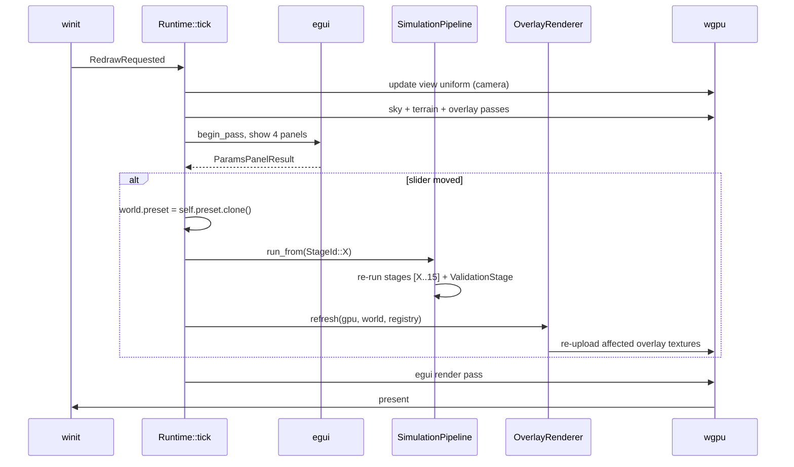

# Architecture

Preliminary architecture overview for Island-Proc-Gen. Intended as a
reference for humans reading the codebase cold — covers the crate
layout, how simulation data flows through the pipeline, how that data
reaches the screen, and the hard invariants that keep the system
extensible.

This document complements two other tracked files:

- [`CLAUDE.md`](../../CLAUDE.md) — operating notes for AI coding
  agents (gotchas, commit style, session protocol).
- [`PROGRESS.md`](../../PROGRESS.md) — sprint-level dashboard with
  commit-level history.

For the big-picture research roadmap (non-tracked, lives in the
author's Obsidian vault) see `docs/design/` locally.

---

## 1. What the project is

A deterministic procedural generator for volcanic islands, written in
Rust. A linear pipeline of simulation stages produces continuous 2D
fields — terrain height, slope, flow accumulation, temperature,
precipitation, soil moisture, biome weights, and a hex-aggregated
summary — over a square grid (currently 256×256). Those fields are
rendered live with `wgpu` + `egui` on macOS / Metal and will
eventually be exportable as CPU-side PNG galleries for headless
batch runs and as a wasm build for the semantic-web viewer.

Everything is driven by a single `(Seed, IslandArchetypePreset)`
pair. Same seed + same preset → bit-exact same output, regardless
of how many times the pipeline re-runs. Load-time rebuild from a
saved seed is the canonical pattern for small save files; baked
snapshot fields are written by the pipeline, not carried by serde.

---

## 2. Crate layout

The workspace has 8 crates. Dependencies flow strictly downward to
`core` — no back-edges, no cycles, no shortcuts.



`core` is a sink crate. `app` is the only crate allowed to wire
everything together — it imports the sim pipeline, the render
pipelines, the UI panels, and the data loaders, then runs the
event loop.

### Why this shape

- `core` has no graphics dependency. `cargo tree -p core` is
  free of `wgpu`, `winit`, `egui`, `png`, `image`, and `tempfile`
  — enforced by the `pipeline_runs_without_graphics` test. This
  is what makes the wasm target feasible without rewriting the
  simulation.
- `render` depends on `core` (reads `WorldState`) and `gpu` (needs
  a device) but not on `sim`. Overlays dispatch over
  `&'static str` field-keys inside `overlay.rs` and nowhere else.
- `data` depends on `core` but never the other way around. Golden
  snapshots and RON presets never pollute the core state layer.

### The `core` crate name shadows stdlib `::core`

Downstream crates import it as `island_core = { path = "../core", package = "core" }`
to avoid path clashes. `crates/core/Cargo.toml` has `[lib] doctest = false`
for the same reason (rustdoc runs `--crate-name core` and
`thiserror`'s derive expands `::core::fmt` paths that can't resolve
inside a user crate called `core`).

---

## 3. Data model: `WorldState`

Every simulation stage reads from and writes to a single
`WorldState` value. The top-level fields are frozen — adding a new
field never means adding a top-level `Option<...>`, only filling in
an inner struct.



The three layers answer three different questions:

| Layer | Question | Save behaviour |
|-------|----------|----------------|
| `authoritative` | "What did erosion / deposition do to the heightfield?" | Written to save files via `ScalarField2D::to_bytes` (the `IPGF` format) |
| `baked` | "What stable derived snapshots do we show to users and golden-test against?" | Written to `SaveMode::Full` (not yet implemented) |
| `derived` | "What runtime caches do we rebuild from `authoritative` on load?" | `#[serde(skip)]` — rebuilt via `run_from(StageId::Coastal)` |

### Field storage

All continuous 2D fields share three type aliases:

- `ScalarField2D<T>` — row-major `Vec<T>` plus width/height.
- `MaskField2D = ScalarField2D<u8>` — 0/1 masks, never `Vec<bool>`
  (so they upload to the GPU and serialize as contiguous bytes).
- `VectorField2D = ScalarField2D<[f32; 2]>` — 2D vectors per cell.

No `trait Field`. If a future stage needs a new dtype, add it to
the sealed `pub(crate) trait FieldDtype` in `core::field` (this is
what gates `to_bytes` / `from_bytes` polymorphism). Everything else
uses the concrete aliases above.

---

## 4. Simulation pipeline

The canonical pipeline is 16 real stages plus a tail
`ValidationStage` that runs 8 invariants. `StageId` in
`crates/sim/src/lib.rs` is the single source of truth for pipeline
indices — every `SimulationPipeline::run_from` caller passes
`StageId::X as usize`, never a literal.



### `run_from` semantics

`SimulationPipeline::run_from(world, start_index)` runs stages
`[start_index..len())` in push order. Preconditions: every field
produced by the prefix `[0..start_index)` must already be populated
on the `WorldState`. The pipeline doesn't introspect stage outputs;
each stage is responsible for its own "missing precondition" error
when an input field is `None`.

Three canonical callers:

- `run_from(0)` — a fresh world or a `SaveMode::Minimal` load.
- `run_from(StageId::Precipitation as usize)` — slider handler for
  a climate parameter change.
- `run_from(StageId::Coastal as usize)` — `SaveMode::Full` load
  rebuilds every `derived` field from `authoritative.height`
  without re-running `TopographyStage`.

### Writing a new stage

1. Implement `SimulationStage` (trait in `crates/core/src/pipeline.rs`):
   ```rust
   pub trait SimulationStage {
       fn name(&self) -> &'static str;
       fn run(&self, world: &mut WorldState) -> anyhow::Result<()>;
   }
   ```
2. Decide which layer the output lives in (`authoritative`,
   `baked`, or `derived`) and add the field inside that struct
   in `core::world`.
3. Add a new variant to `StageId`; update `stage_id_indices_are_dense_and_canonical`.
4. Push the stage in the pipeline builder in `crates/app/src/runtime.rs`
   at the right index.
5. If the new stage produces a validation-checkable output, add
   an invariant to `core::validation` and wire it into
   `sim::ValidationStage`.
6. If the stage is a slider target, add a UI control in
   `crates/ui/src/params_panel.rs` and a `run_from(StageId::X)` branch
   in `Runtime::tick`.

---

## 5. Render + UI runtime

`Runtime::tick` runs once per frame. The simulation pipeline already
ran at boot, so the tick loop is render + UI + slider-driven re-runs.



### Overlay rendering path

Overlays are data descriptors, not render closures.
`OverlayRegistry` in `crates/render/src/overlay.rs` stores
`Vec<OverlayDescriptor>` where each descriptor names a source field
by `&'static str`, a palette, and a value range. The `draw` step
resolves the source to a typed field borrow via
`resolve_scalar_source` (which is the *only* place in the codebase
that string-key dispatches over `WorldState` layout), then samples
the palette per cell into an RGBA8 texture.

The overlay descriptor contract is what lets the same descriptor
drive both the real-time GPU render path today and the CPU-side
PNG batch export path in a future sprint. Any "render closure"
shortcut would lock the PNG export story and must be rejected.

---

## 6. Architectural invariants

These are enforced by tests and CI, not just convention. Breaking
any of them reverts to `dev` and re-opens the sprint that broke it.

1. **`core` stays headless.** `cargo tree -p core` must never list
   `wgpu`, `winit`, `egui*`, `png`, `image`, or `tempfile`. The
   `pipeline_runs_without_graphics` test in `core::pipeline`
   enforces this at the build level.
2. **No `&Path` or `std::fs` in `core`.** The save codec is byte-
   level (`impl Write` / `impl Read`); `app::save_io` is the only
   ~5-line Path wrapper. Wasm must work without touching `core`.
3. **`WorldState` is three-layer.** Top-level fields are exactly
   `{ seed, preset, resolution, authoritative, baked, derived }`.
   Never add `Option<ScalarField2D<...>>` to the top level — put
   it under `authoritative`, `baked`, or `derived`. `derived` is
   `#[serde(skip)]`.
4. **`Resolution` is simulation-only.** `sim_width` / `sim_height`
   live on `WorldState`. Render LOD and hex cell counts live in
   their own crates and are NOT part of canonical state.
5. **No `Vec<bool>`.** Masks are `MaskField2D = ScalarField2D<u8>`
   with the `0 = false / 1 = true` convention, so GPU upload / PNG
   export / serde are contiguous byte arrays.
6. **Field abstraction is not a trait.** `ScalarField2D<T>` +
   `MaskField2D` + `VectorField2D` aliases only. No `trait Field`.
   (The internal sealed `pub(crate) trait FieldDtype` over
   `u8|u32|f32|[f32; 2]` is a private implementation detail.)
7. **Overlays are descriptors, not closures.** `OverlayRegistry`
   stores `Vec<OverlayDescriptor>`. Any "render closure" pattern
   locks the CPU-side PNG export path and must be rejected.
8. **String field keys live only in `crates/render/src/overlay.rs`.**
   `crates/sim`, `crates/core::save`, and `crates/core::validation`
   access state via struct field paths like
   `world.authoritative.height` — not by stringly-typed dispatch.

---

## 7. File layout

```
Island-Proc-Gen/
├── Cargo.toml                 # workspace root
├── rust-toolchain.toml        # pin stable Rust (edition 2024, rustc ≥ 1.85)
├── shaders/                   # WGSL shaders — read via include_str!
│   ├── terrain.wgsl           # height ramp + sea blend + key/fill/ambient
│   ├── overlay.wgsl           # per-descriptor texture sample + alpha blend
│   └── sky.wgsl               # full-screen gradient
├── assets/
│   ├── visual/
│   │   └── palette_reference.jpg  # canonical 8-colour palette (pixel-locked)
│   ├── noise/
│   │   ├── LICENSE.md             # Calinou CC0 attribution
│   │   └── blue_noise_2d_{64,128,256}.png
│   └── screenshots/
│       └── hero.png           # README preview
├── crates/
│   ├── core/                  # field types, WorldState, pipeline trait, validation
│   ├── sim/                   # 16 canonical stages + tail ValidationStage
│   │   ├── geomorph/
│   │   ├── hydro/
│   │   ├── climate/
│   │   ├── ecology/
│   │   └── hex_projection.rs
│   ├── hex/                   # HexGrid + axis-aligned box tessellation (v1)
│   ├── data/                  # presets (RON), golden snapshots, SummaryMetrics
│   │   ├── presets/           # volcanic_single, volcanic_twin, caldera
│   │   └── golden/snapshots/  # per-seed regression snapshots
│   ├── gpu/                   # wgpu device/surface/depth management
│   ├── render/                # terrain + overlay + sky pipelines, palette, noise
│   ├── ui/                    # egui panels (overlay, params, stats)
│   └── app/                   # winit event loop, Runtime, save_io Path wrapper
├── docs/
│   ├── architecture/          # this directory — tracked architecture docs
│   └── papers/                # tracked paper knowledge base (Core Pack + sprint packs)
├── CLAUDE.md                  # agent operating notes
├── PROGRESS.md                # sprint dashboard + history
└── README.md                  # public-facing project readme
```

---

## 8. Versioning + compatibility

- **Rust toolchain:** stable, edition 2024, `rustc >= 1.85`
  (pinned by `rust-toolchain.toml`).
- **Graphics stack pins:** `egui` / `egui-wgpu` / `egui-winit` at
  `0.34.1`, `wgpu` at `29.0.1`, `winit` at `0.30.13`. Don't mix
  versions without verifying the egui / wgpu compatibility matrix.
- **CI gate:**
  `cargo fmt --check && cargo clippy --workspace -- -D warnings && cargo test --workspace`
  runs on macOS (Metal backend available). No headless GPU tests on
  the CI runner — `app` / `render` / `gpu` tests that need a device
  are excluded.
- **Target platforms:** macOS-first development; the architecture
  stays platform-agnostic so a future wasm build can reuse `core`,
  `sim`, `hex`, and `data` unchanged.

---

## 9. What this document deliberately omits

- Per-stage algorithmic details (lapse rates, Budyko ω, suitability
  bell curves). Those live in the sprint docs under `docs/design/`
  (gitignored Obsidian vault) and in inline module docs in
  `crates/sim/src/`.
- Paper references and the research framing. See
  [`docs/papers/README.md`](../papers/README.md) for the indexed
  knowledge base.
- Sprint timelines and acceptance-checklist status. See
  [`PROGRESS.md`](../../PROGRESS.md).
- Operating instructions for AI coding agents. See
  [`CLAUDE.md`](../../CLAUDE.md).
